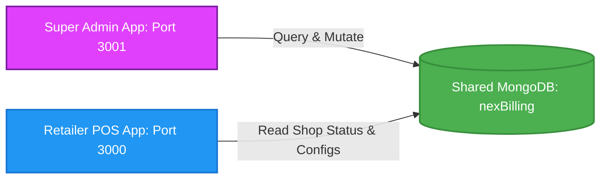

# NexBill Super Admin Architecture

The Super Admin Control Panel is the command center of the NexBill platform. It provides platforms telemetry, configures payment gateways (UPI QR code uploads), registers and updates shop subscription terms, and monitors retailers' active statuses.

---

## Shared Database Context

The Super Admin app is connected directly to the same MongoDB replica set database (`nexBilling`) as the retailer terminals.



### Shared Collections
The Admin Control Panel reads and updates data across the shared collections:
- **Shops**: Subscription expirations, activity states, and shop descriptors.
- **SystemConfigs**: Central configurators like the payment UPI QR URL.
- **Payments**: Audit logs of manual renewals recorded by the administrators.

---

## Technical Stack

| Layer | Technology | Purpose |
| :--- | :--- | :--- |
| **Framework** | Next.js 16 (App Router) | React Server Components, server-side layouts, API proxying. |
| **Database** | Mongoose 9.x | Database connection, modeling, and aggregation queries. |
| **Authentication** | JWT (JSON Web Tokens) | Signed administrative session tokens stored inside secure `admin_session` cookies. |
| **Styling** | Tailwind CSS 4.x | Fluid, responsive dashboard telemetry grids. |
| **Image Upload** | Cloudinary Integration | Cloud storage for uploaded UPI QR code assets. |

---

## Directory Organization

```text
billing--system-admin/
├── src/
│   ├── app/                    # Next.js App Router root
│   │   ├── api/                # Administrative API endpoints
│   │   │   ├── auth/           # Login session issuing
│   │   │   ├── payments/       # Billing renewal audit logs
│   │   │   ├── shops/          # Shop query & subscription extenders
│   │   │   └── upload/         # Cloudinary file upload proxy
│   │   ├── analytics/          # Projected collections telemetry
│   │   ├── login/              # Admin auth screen
│   │   ├── globals.css         # CSS styles & design values
│   │   ├── layout.tsx          # Root framework & navigation headers
│   │   └── page.tsx            # Main shops grid and operational modals
│   ├── lib/                    # Shared helper libraries
│   │   ├── db.ts               # Database pooling helper
│   │   └── whatsapp.ts         # Twilio client (configured for future notifications)
│   ├── models/                 # Alignment schemas
│   │   ├── Shop.ts             # Shop subscriptions & active trackers
│   │   ├── Payment.ts          # Manual cash flow renewals
│   │   └── SystemConfig.ts     # Configuration parameters
│   └── proxy.ts                # Request context helpers
└── package.json                # Project configurations & dev scripts
```

---

## Security & Session Scoping

Administrative pages and endpoints are locked by checking the JWT session inside the `admin_session` cookie:
1. **Cookie Gate**: The middleware parses the incoming request's cookies.
2. **JWT Signature Decryption**: Evaluates if the token contains a valid username and the role `'super-admin'`.
3. **Rejection**: If the token is invalid or the role does not match, the system redirects to `/login` or returns an HTTP `401 Unauthorized` response.
