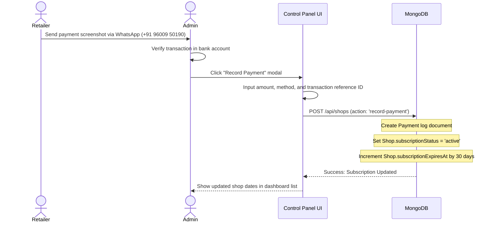
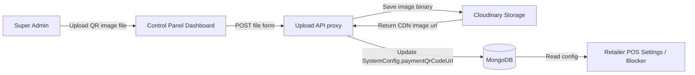

# Subscription Management & Verification Flow

This document details the manual subscription lifecycle, billing categories, and configurator tools.

---

## 1. Shop Operational Statuses

The Super Admin dashboard lists retailers and classifies their operations using four calculated subscription states:

| Status | Condition | Terminal Behavior | Admin Dashboard Flag |
| :--- | :--- | :--- | :--- |
| **Active** | `ExpiresAt` is in the future. | Fully operational. | Normal status. |
| **Expiring Soon** | `ExpiresAt` is within 3 days. | Fully operational. | Highlighted warning. |
| **Grace Period** | `ExpiresAt` is expired, but by less than 3 days. | Operational with warning banner. | Highlighted grace period flag. |
| **Suspended / Locked** | `ExpiresAt` is expired by more than 3 days. | Locked out by blocker overlay. | Flagged as Suspended. |

---

## 2. Manual Payment Extension Workflow

NexBill operates a manual verification billing cycle. Because there are no automated payment webhooks, shop owners pay via UPI QR and admins verify transactions manually.

### Renewal Details
- **Log Entry**: Recording a payment adds a document inside the `payments` collection to maintain a clean financial audit log.
- **Auto-unlocking**: The retailer terminal polls for auth status frequently. Once the admin updates their dates in the DB, the lockout overlay vanishes automatically.

---

## 3. Dynamic UPI QR Configurations

The QR code shown on the retailer lockout backdrop and settings panel is managed centrally.

### QR Assets Management
- The Upload API route (`/api/upload`) acts as a secure backend proxy to Cloudinary. It keeps administrative API credentials confidential.
- The CDN image link is stored in the `SystemConfig` collection, making changes to the QR code instant across all retail POS apps without code deploys.
